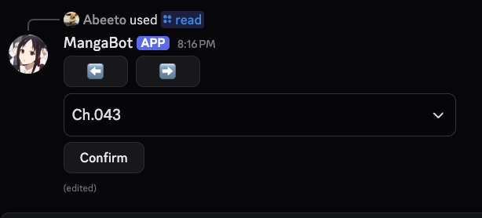

# Discord Manga Bot

A Discord bot for browsing and reading manga directly within Discord using data scraped from [MangaPark](https://mangapark.com).

## Usage

- 🔍 **Search for manga** through the MangaPark database.
- 📚 **Browse chapters** from the search results
- 📖 **Read manga pages** directly in Discord

## Screenshots

| Select Manga | Select Chapter | Read Manga |
|--------------|----------------|------------|
|  |  |  |

## Project Structure

This project has two major parts:

1. **Manga Scraper**  
   Uses `BeautifulSoup` to scrape manga titles, chapters, and image URLs from [MangaPark](https://mangapark.com).

2. **Discord Bot**  
   Built using `py-cord`.
